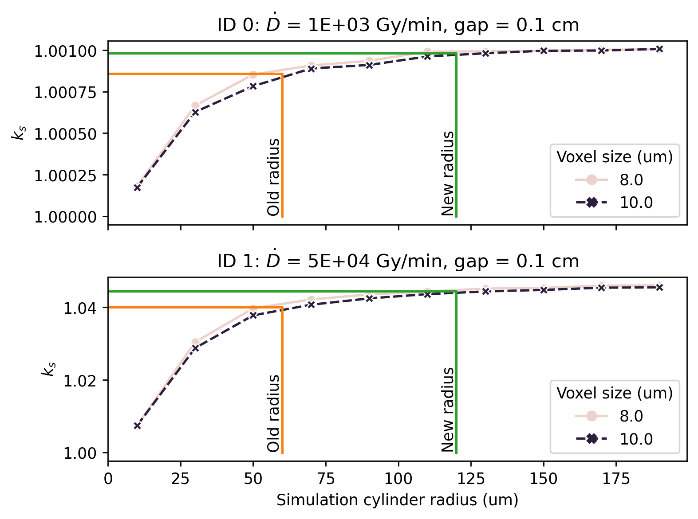
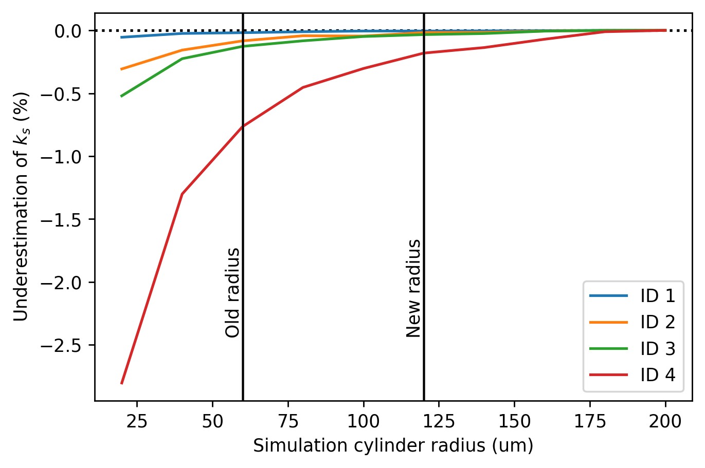

The following is related to the simulation of continuous beams only.

## 1 Stability analysis

The current scheme to solve the partial differential equations (PDEs) involves a grid with parameters where
- ```unit_length_cm``` defines the grid voxel size. The smaller, the finer resolution and longer computation time
- ```radius_cm``` defines the radius of the simulation cylinder where the ion tracks are sampled. The longer the radius, the more tracks are sampled, and the longer the compuation time

The simulation converges only when 
- a sufficient large simulation radius is chosen
- a sufficient small voxel size is used  

The recombination correction factor *k_s* was simulated for dose-rates (1 - 10) kGy/min and electrode gaps (0.1-0.2) cm and shown in the subfigures below, where each subtitle defines how the parameters were varied:



It is evident from the subfigures that the previous choice of ```radius_cm = 0.006``` was too small and that the correction factor $k_s$ converges for sufficiently large radius values as required. However, as the number of voxels increases non-linearly with the simulation radius, choosing a too large value of  ```radius_cm``` would result in unnecessarily long computation times. 

In order to find a suitable value for ```radius_cm```, the underestimation of the calculated value of $k_s$ relative to the *true* value of $k_s$ (taken as the value for ```radius_um = 200```) is plotted in the figure below as a function of ```radius_cm```. The *ID* numbers in the figure legend below refers to the *ID* numbers in the subtitles in the figure above.



From the figure, it appears that *k_s* converges for ```radius_um > 175``` which almost would increase the computation time by an order of magnitude relative to the previous value. As a compromise, a new default of twice the value (```radius_cm = 0.012```) is chosen, increasing the simulation time by a factor of about 4 but causing a pretty negligible variation of $k_s$ across the investigated parameters. 


## 2 Number of tracks in a simulation
Currently, the simulation of a continuous beam is divided into two parts defined by the time it takes to collect the charges of a given ion track. The first time is regarded as a build-up time where no recombination is scored. The second part mimics is steady-state case where the recombination is scored and the recombination correction factor is calculated.

Specifically, given a time step ```dt```, it takes  
```
cdef int separation_time_steps = int(d_cm/(2.*ion_mobility*Efield_V_cm*dt))  
```  
steps to move a charge from one electrode to the opposite, where 
- ```d_cm``` denotes the eletrode gap (cm)
- ```ion_mobility``` is the mobility of ions (cm^2/V/s) and 
- ```Efield_V_cm``` is the electric field (V/cm)

The total number of steps in the simulation is per default derived from the time (and hence number of steps) it takes to move the charge carriers between the electrodes as  
```
cdef int n_separation_times = 3
cdef int computation_time_steps = separation_time_steps * n_separation_times
```
where ```n_separation_times``` is chosen large enough such that the difference between two simulations run with the same parameters should be negligible. Consequently, the simulation time is given as 
```
cdef double simulation_time_s = computation_time_steps*dt
```

The number of tracks to be initialised is computed from the fluence-rate ```fluence_cm2_s``` and simulation radius area ```area_cm2``` as
```
cdef int number_of_tracks = int(fluence_cm2_s* simulation_time_s*area_cm2)
```
where the simulation radius area ```area_cm2``` is derived from the ```radius_cm``` defined above. 

As a consequence of this approach, varying the electrode gap ```d_cm``` or electric field strength ```Efield_V_cm``` will change the time it takes to collect the charges ```separation_time_steps``` and eventually the simulation time and number of tracks inserted in the array.


### Charge carrier build-up
The first ```separation_time_steps``` are regarded as a build-up time where no recombnation is counted, see
```
if time_step > separation_time_steps:
    if k > no_z_electrode and k < (no_z + no_z_electrode):
        if sqrt((i - mid_xy_array) ** 2 + (j - mid_xy_array) ** 2) < inner_radius:
            no_recombined_charge_carriers += recomb_temp
```
In this particular simulation (```computation_time_steps = separation_time_steps * 3```), the recombination would be counted over the remaining  ```computation_time_steps = separation_time_steps * (3 - 1)``` time steps as the first ```separation_time_steps*1``` only serve as a build-up.

Note, that this approach may not necessarily be correct. However, if the recombination would be counted for all time steps (as in a real ionization chamber), then choosing a large number of charge separation times ```n_separation_times``` would remedy the effect of the build-up, eventually causing it to be negligible.

